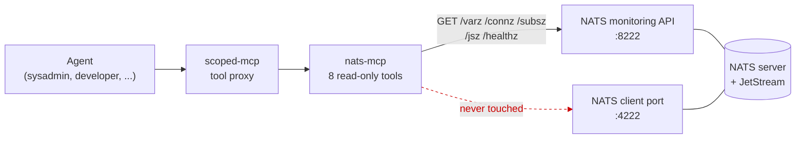

[](https://claude.ai/code)
[](https://opensource.org/licenses/MIT)

# nats-mcp

FastMCP Python MCP server for NATS messaging bus health. Gives agents read-only
access to server stats, client connections, subscriptions, JetStream streams and
consumers, and health via the NATS HTTP monitoring API.

## Architecture



nats-mcp reads the monitoring API only. It never opens a NATS client connection,
never subscribes, and never publishes — there is no code path from a tool call to
port 4222.

## Tools

| Tool | Description |
|------|-------------|
| `get_server_stats` | Server stats: version, uptime, connections, messages, memory, CPU |
| `get_connections` | Client connections, open or closed — with IP, `authorized_user` and disconnect reason |
| `get_subscription_stats` | Subscription counts, cache hit rate, fanout stats |
| `get_jetstream_status` | JetStream account totals: stream/consumer counts, bytes, API stats |
| `get_streams` | Per-stream inventory: subjects, message counts, sequences, retention |
| `get_stream` | Full config and state for one stream |
| `get_consumers` | Per-consumer lag: pending, ack-pending, redelivered |
| `get_health` | Health check — ok or error, with JetStream-only variants |

### Diagnosing a misbehaving client

`get_connections(state="closed")` is the tool for "which client is failing to
authenticate?". Closed connections carry `reason`, which reads
`"Authorization Violation"` for a rejected credential, alongside `authorized_user`
and `ip`:

```python
get_connections(state="closed", limit=50)
# {"connections": [{"authorized_user": "githost-mcp-steward",
#                   "ip": "172.20.1.52",
#                   "reason": "Authorization Violation",
#                   "stop": "2026-08-30T06:09:06Z", ...}]}
```

## Configuration

| Variable | Default | Required | Purpose |
|----------|---------|----------|---------|
| `NATS_MONITOR_URL` | `http://localhost:8222` | No | NATS HTTP monitoring endpoint |
| `NATS_MCP_PORT` | (none) | No | Set to enable HTTP transport on `127.0.0.1:<port>`. Unset = stdio (default). |
| `NATS_MCP_API_TOKEN` | (none) | No | Bearer token for HTTP mode authentication. Uses `hmac.compare_digest()`. Only active when `NATS_MCP_PORT` is also set. |
| `NATS_MCP_HOST` | `127.0.0.1` | No | HTTP bind address. Set `0.0.0.0` in a container. Only used when `NATS_MCP_PORT` is set. |
| `LOG_LEVEL` | `INFO` | No | structlog log level |
| `LOG_FILE` | (none) | No | Extra file sink. Unset = stdout only; no file and no directory are created. |
| `OTEL_EXPORTER_OTLP_ENDPOINT` | (none) | No | OTLP **gRPC** endpoint (port 4317, not 4318). Enables traces and metrics. |

### Transport modes

**Stdio (default)** — when `NATS_MCP_PORT` is not set, the server runs in stdio mode for direct Claude Code / scoped-mcp subprocess usage.

**HTTP (streamable-http)** — when `NATS_MCP_PORT` is set, the server serves MCP over streamable-http on `NATS_MCP_HOST:<port>`, defaulting to `127.0.0.1`. If `NATS_MCP_API_TOKEN` is also set, all HTTP requests must include `Authorization: Bearer <token>`. A warning is logged if HTTP mode runs without a token.

Inside a container set `NATS_MCP_HOST=0.0.0.0`: binding the container's own loopback makes the server unreachable from the Docker network. The bind address is not the security control in a network namespace — the compose `ports:` publish is, and the bearer token is.

## Observability

Logs are JSON on **stdout**. Set `LOG_FILE` to also write a file; leave it unset (the default) and no file or directory is created. Rotation is the deployment layer's job — under Docker use the `json-file` driver with `max-size`/`max-file`.

Third-party loggers (`httpx`, `httpcore`, `mcp`, `fastmcp`, `uvicorn`, `starlette`) are pinned to WARNING so `LOG_LEVEL=DEBUG` does not drown the service's own lines in wire trace.

Setting `OTEL_EXPORTER_OTLP_ENDPOINT` enables OpenTelemetry and requires the `otel` extra (`pip install -e ".[otel]"`):

| Signal | Name | Labels |
|---|---|---|
| Span | `nats_mcp.<tool>` | per-call attributes |
| Counter | `nats_mcp.tool.calls` | `tool`, `outcome` (`ok` or the exception class) |
| Histogram | `nats_mcp.tool.duration` (ms) | `tool`, `outcome` |

The endpoint must be OTLP over **gRPC — port 4317**. Pointing it at 4318 (the HTTP port) fails silently. On forge: `http://localhost:4317` on the host, `http://signoz-otel-collector:4317` in a container.

## Installation

```bash
python3 -m venv .venv && source .venv/bin/activate
pip install -e .
```

## Running

```bash
# Stdio mode (default)
python -m nats_mcp.server

# HTTP mode with bearer auth
NATS_MCP_PORT=8508 NATS_MCP_API_TOKEN=your-token python -m nats_mcp.server

# Via PM2
pm2 start ecosystem.config.js
```

## Development

```bash
pip install -e ".[dev,otel]"
pytest
pytest --cov=nats_mcp --cov-report=term-missing
ruff check .
ruff format .
```
